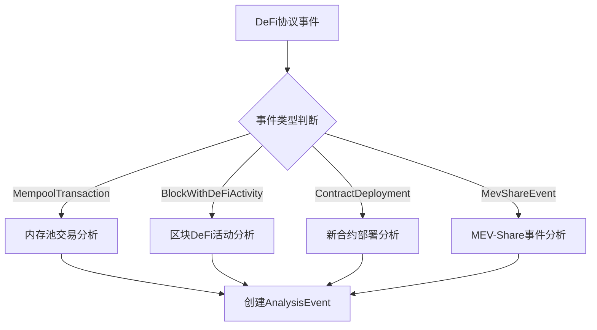
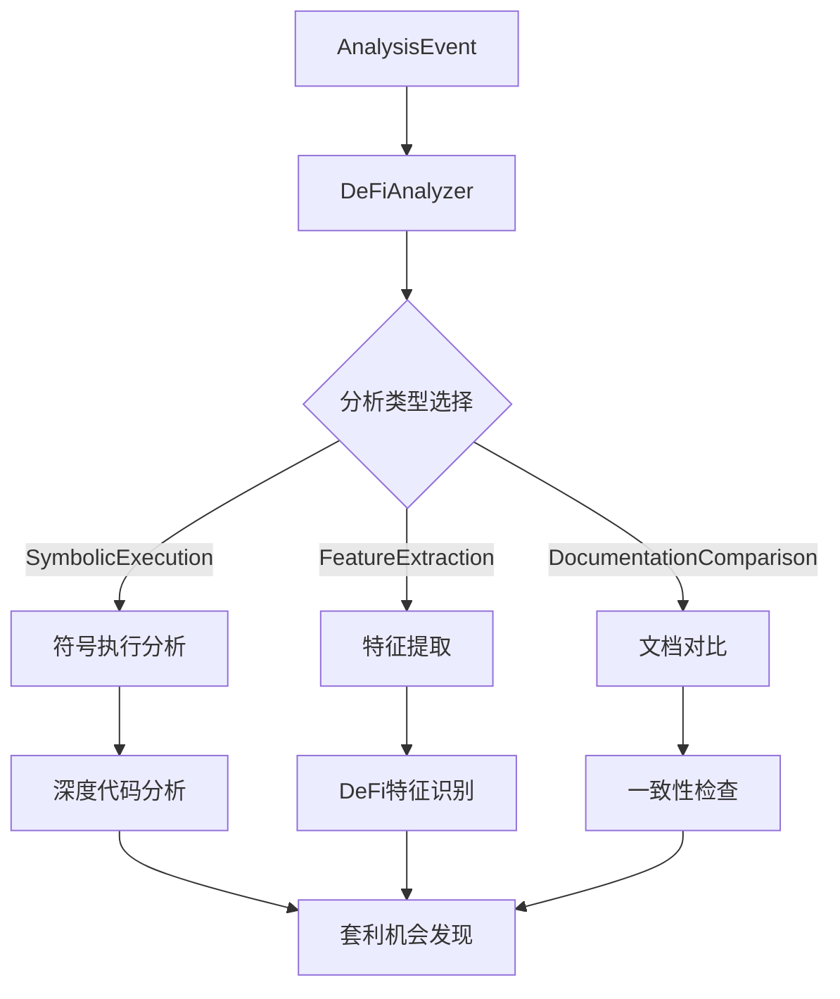
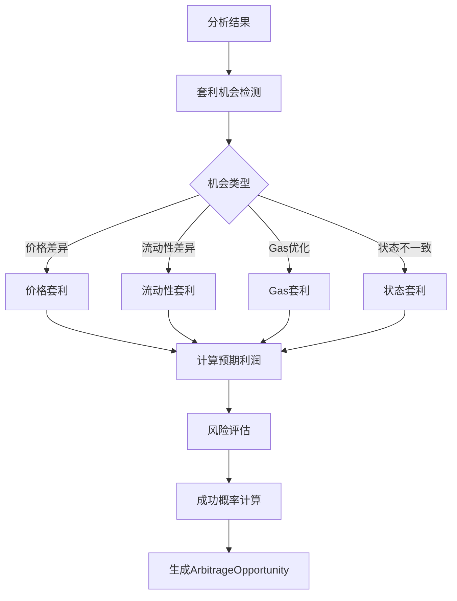
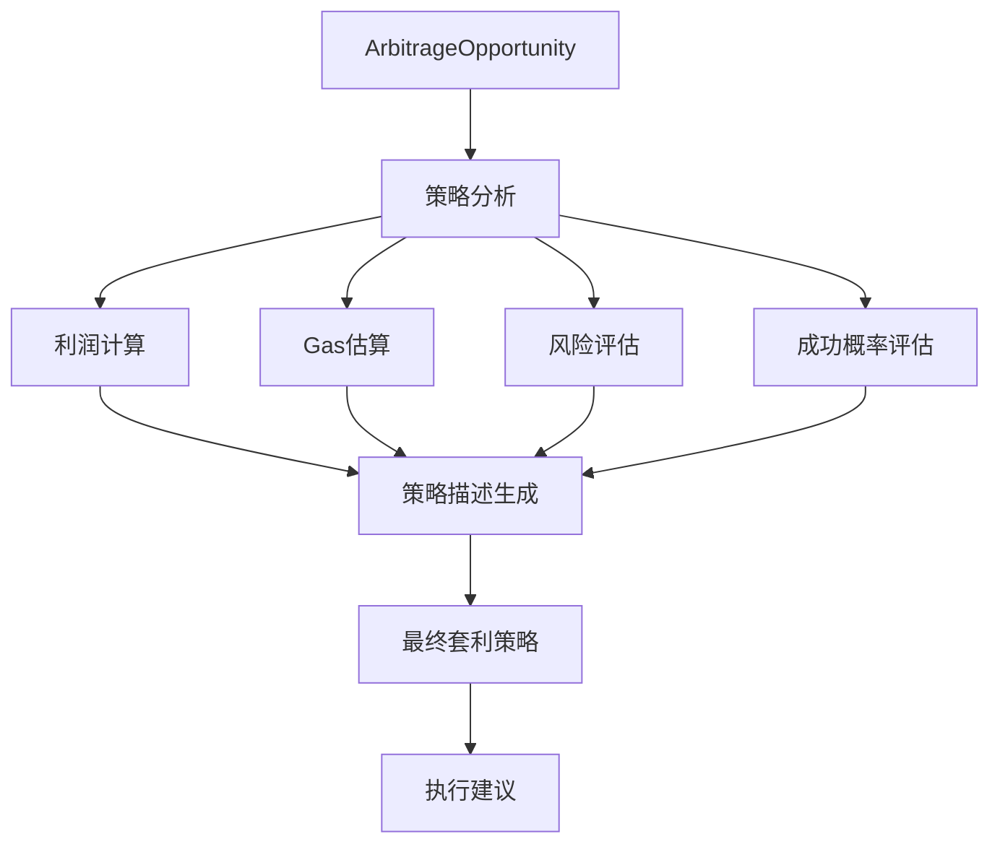

# 🔍 DeFi Analyzer 套利流程分析

## 📊 套利专用组件分析

### 1. **套利机会数据结构**

```rust
/// 套利机会
#[derive(Debug, Clone, Serialize, Deserialize)]
pub struct ArbitrageOpportunity {
    /// 机会ID
    pub opportunity_id: String,
    /// 预期利润 (wei)
    pub expected_profit: U256,
    /// 所需Gas
    pub required_gas: u64,
    /// 成功概率
    pub success_probability: f64,
    /// 风险等级
    pub risk_level: RiskLevel,
    /// 策略描述
    pub strategy_description: String,
}
```

### 2. **风险等级评估**

```rust
/// 风险等级
#[derive(Debug, Clone, Serialize, Deserialize)]
pub enum RiskLevel {
    /// 低风险
    Low,
    /// 中等风险
    Medium,
    /// 高风险
    High,
}
```

### 3. **分析结果中的套利部分**

```rust
/// 详细分析结果
#[derive(Debug, Clone, Serialize, Deserialize)]
pub struct AnalysisResults {
    /// DeFi特征
    pub defi_features: DeFiFeatures,
    /// 检测到的不一致性
    pub inconsistencies: Vec<Inconsistency>,
    /// 潜在套利机会
    pub arbitrage_opportunities: Vec<ArbitrageOpportunity>,
    /// 风险评估
    pub risk_assessment: RiskAssessment,
    /// 建议
    pub recommendations: Vec<String>,
}
```

## 🔄 套利流程分析

### 阶段1: 事件触发


### 阶段2: 分析启动


### 阶段3: 套利机会识别


### 阶段4: 套利策略生成


## 🎯 套利专用配置

### 1. **套利相关配置参数**

```rust
pub struct AnalyzerConfig {
    /// 最小利润阈值 (wei)
    pub min_profit_threshold: U256,  // 默认: 0.1 ETH
    /// 风险容忍度 (0-100)
    pub risk_tolerance: u8,         // 默认: 50
    /// 分析超时时间 (秒)
    pub analysis_timeout_seconds: u64, // 默认: 30
    /// 最大分析深度
    pub max_analysis_depth: u32,    // 默认: 10
}
```

### 2. **性能优化配置**

```rust
pub struct PerformanceSettings {
    /// 最大并发分析数
    pub max_concurrent_analyses: usize, // 默认: 10
    /// 启用并行处理
    pub enable_parallel_processing: bool, // 默认: true
    /// 内存使用限制 (MB)
    pub memory_limit_mb: usize,        // 默认: 1024
    /// CPU使用限制 (百分比)
    pub cpu_limit_percentage: u8,      // 默认: 80
}
```

## 🔍 套利机会识别流程

### 1. **符号执行分析**
```rust
// 伪代码示例
async fn analyze_for_arbitrage(
    contract_address: Address,
    abi: &str,
    function_name: &str
) -> Result<Vec<ArbitrageOpportunity>> {
    // 1. 加载合约ABI
    let abi = load_abi(abi)?;
    
    // 2. 符号执行分析
    let symbolic_result = run_symbolic_execution(
        contract_address,
        &abi,
        function_name
    ).await?;
    
    // 3. 提取套利机会
    let opportunities = extract_arbitrage_opportunities(
        &symbolic_result
    )?;
    
    // 4. 计算利润和风险
    let analyzed_opportunities = analyze_opportunities(
        opportunities
    ).await?;
    
    Ok(analyzed_opportunities)
}
```

### 2. **特征提取分析**
```rust
// 识别DeFi特征
async fn extract_defi_features(
    contract_address: Address
) -> Result<DeFiFeatures> {
    let features = DeFiFeatures {
        balance_changes: count_balance_changes(contract_address).await?,
        conditional_constraints: count_constraints(contract_address).await?,
        eth_transfers: count_eth_transfers(contract_address).await?,
        token_operations: count_token_operations(contract_address).await?,
        liquidity_operations: count_liquidity_operations(contract_address).await?,
    };
    
    Ok(features)
}
```

### 3. **套利机会评分**
```rust
// 套利机会评分算法
fn score_arbitrage_opportunity(
    opportunity: &ArbitrageOpportunity
) -> f64 {
    let profit_score = opportunity.expected_profit.as_u128() as f64 / 1e18;
    let success_score = opportunity.success_probability;
    let risk_penalty = match opportunity.risk_level {
        RiskLevel::Low => 0.1,
        RiskLevel::Medium => 0.3,
        RiskLevel::High => 0.5,
    };
    
    profit_score * success_score * (1.0 - risk_penalty)
}
```

## 📊 套利机会类型分析

### 1. **价格套利**
- **检测方法**: 符号执行发现价格差异
- **利润计算**: `(price_a - price_b) * amount`
- **风险因素**: 价格波动、滑点、Gas费用
- **成功概率**: 基于历史数据和市场条件

### 2. **流动性套利**
- **检测方法**: 分析流动性池状态变化
- **利润计算**: 流动性差异产生的套利空间
- **风险因素**: 流动性变化、无常损失
- **成功概率**: 基于流动性深度和交易量

### 3. **Gas套利**
- **检测方法**: 发现Gas优化机会
- **利润计算**: 节省的Gas费用
- **风险因素**: 网络拥堵、Gas价格波动
- **成功概率**: 基于网络状态和Gas价格

### 4. **状态套利**
- **检测方法**: 发现合约状态不一致
- **利润计算**: 利用状态差异获利
- **风险因素**: 状态同步延迟、竞争风险
- **成功概率**: 基于状态更新频率

## 🚀 套利执行流程

### 1. **机会筛选**
```rust
async fn filter_arbitrage_opportunities(
    opportunities: Vec<ArbitrageOpportunity>,
    config: &AnalyzerConfig
) -> Vec<ArbitrageOpportunity> {
    opportunities
        .into_iter()
        .filter(|opp| {
            // 利润阈值筛选
            opp.expected_profit >= config.min_profit_threshold &&
            // 风险容忍度筛选
            opp.risk_level as u8 <= config.risk_tolerance &&
            // 成功概率筛选
            opp.success_probability > 0.7
        })
        .collect()
}
```

### 2. **优先级排序**
```rust
async fn prioritize_opportunities(
    opportunities: Vec<ArbitrageOpportunity>
) -> Vec<ArbitrageOpportunity> {
    let mut sorted = opportunities;
    sorted.sort_by(|a, b| {
        let score_a = score_arbitrage_opportunity(a);
        let score_b = score_arbitrage_opportunity(b);
        score_b.partial_cmp(&score_a).unwrap()
    });
    sorted
}
```

### 3. **执行建议生成**
```rust
async fn generate_execution_advice(
    opportunity: &ArbitrageOpportunity
) -> ExecutionAdvice {
    ExecutionAdvice {
        strategy: opportunity.strategy_description.clone(),
        gas_limit: opportunity.required_gas,
        gas_price: calculate_optimal_gas_price(opportunity),
        max_slippage: calculate_max_slippage(opportunity),
        execution_timing: calculate_optimal_timing(opportunity),
    }
}
```

## 📈 套利性能指标

### 1. **关键指标**
- **机会发现率**: 每小时发现的套利机会数量
- **利润准确率**: 预测利润与实际利润的匹配度
- **执行成功率**: 套利策略的成功执行率
- **风险控制**: 风险评分与实际损失的关联度

### 2. **优化目标**
- **响应时间**: < 100ms 机会识别
- **分析深度**: 10层深度符号执行
- **并发处理**: 10个并发分析
- **内存效率**: < 1GB 内存使用

## 🎯 总结

`defi-analyzer` 的套利功能通过以下核心流程实现：

1. **事件触发** → 监听DeFi协议活动
2. **符号执行** → 深度分析智能合约逻辑
3. **特征提取** → 识别DeFi协议特征
4. **机会发现** → 发现套利机会
5. **风险评估** → 评估利润和风险
6. **策略生成** → 生成可执行的套利策略

这个流程结合了**学术级的符号执行技术**和**实用的MEV套利需求**，为Artemis提供了强大的DeFi协议分析能力。
