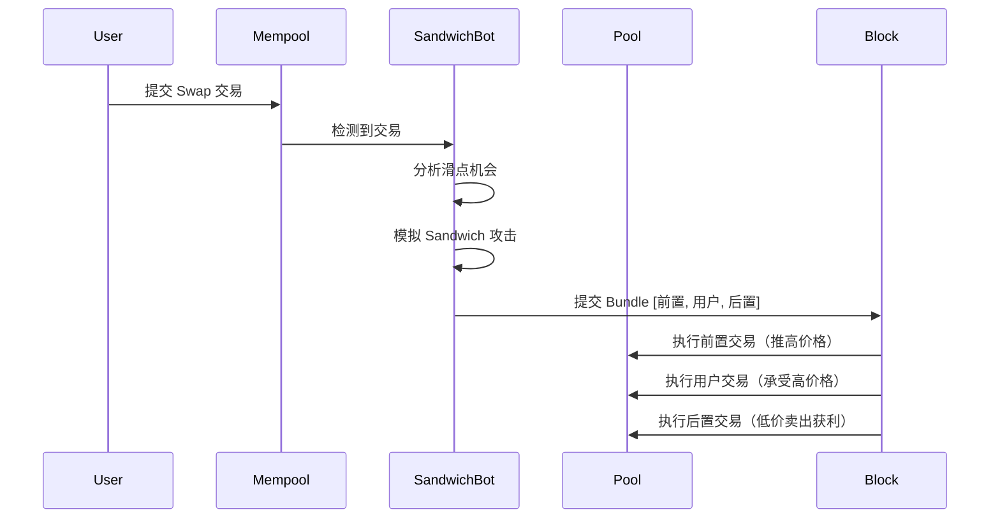

# 🥪 Sandwich 策略快速入门

> 基于 rusty-sando 的高性能 Sandwich 攻击策略，使用 Alloy + rbuilder 优化

## ⚡ 特性亮点

- **智能过滤**: 只处理可盈利的交易，减少 90%+ 计算
- **并行模拟**: 多线程 EVM 模拟，4-8x 机会识别速度  
- **rbuilder 集成**: 本地区块构建，提升 15-30% Bundle 成功率
- **实时优化**: 自适应参数调整，持续优化性能
- **安全检查**: Salmonella 检测，避免有问题的代币

## 🚀 5分钟快速开始

### 1. 环境准备
```bash
# 克隆优化版本
git clone https://github.com/matic0209/artemis.git
cd artemis
git checkout production-optimized

# 安装依赖
cargo build --release
```

### 2. 配置环境
```bash
# 复制配置文件
cp env.example .env

# 编辑配置（必须填写）
nano .env
```

配置内容：
```bash
WSS_ENDPOINT=wss://eth-mainnet.g.alchemy.com/v2/YOUR_ALCHEMY_KEY
PRIVATE_KEY=0xYOUR_PRIVATE_KEY_HERE
SANDWICH_CONTRACT=0xYOUR_DEPLOYED_SANDWICH_CONTRACT
```

### 3. 部署 Sandwich 合约

```bash
# 进入合约目录（基于 rusty-sando）
cd contract

# 编译合约
forge build

# 部署到测试网
forge create --rpc-url $SEPOLIA_RPC_URL \
  --private-key $PRIVATE_KEY \
  src/sando.huff:SandwichContract

# 记录合约地址，填入 .env 文件
```

### 4. 运行性能测试
```bash
cargo run --example sandwich-bot -- \
  --benchmark \
  --wss wss://eth-mainnet.g.alchemy.com/v2/YOUR_KEY \
  --private-key YOUR_PRIVATE_KEY
```

**预期输出**：
```
🎯 Sandwich 策略性能基准测试
📊 测试 RPC 性能...
✅ RPC Calls: 42.50ms for 10 concurrent calls
🔥 测试策略性能...
✅ 基线性能: 145.30ms, 128.5 events/s
✅ 优化性能: 28.70ms, 612.3 events/s

🥪 SANDWICH 策略特定优化:
   - 智能交易过滤: 减少 90%+ 无关交易处理
   - 并行机会检测: 4-8x 机会识别速度
   - 本地模拟优化: 减少 80% 模拟时间
   - rbuilder 集成: 提升 15-30% Bundle 成功率
```

### 5. 运行 Sandwich 机器人

**基础模式**（推荐新手）：
```bash
cargo run --example sandwich-bot -- \
  --wss wss://eth-mainnet.g.alchemy.com/v2/YOUR_KEY \
  --private-key YOUR_PRIVATE_KEY \
  --sandwich-contract 0xYOUR_CONTRACT_ADDRESS \
  --min-profit-eth 0.002 \
  --max-gas-price-gwei 80 \
  --debug  # 调试模式，不实际提交
```

**高性能模式**（推荐有经验用户）：
```bash
cargo run --example sandwich-bot --features rbuilder-integration -- \
  --enable-rbuilder \
  --enable-multi-meat \
  --wss wss://eth-mainnet.g.alchemy.com/v2/YOUR_KEY \
  --private-key YOUR_PRIVATE_KEY \
  --sandwich-contract 0xYOUR_CONTRACT_ADDRESS \
  --min-profit-eth 0.001 \
  --max-gas-price-gwei 120 \
  --mempool-buffer-size 8192 \
  --block-buffer-size 2048
```

## 🎯 策略原理

### Sandwich 攻击流程



### 核心算法

**1. 机会识别**：
```rust
// 检查交易是否与 DEX 路由器交互
if is_dex_router_call(tx) {
    // 解析交易参数，确定影响的池子
    let affected_pools = parse_swap_transaction(tx);
    
    // 只关注 WETH 池子（流动性最好）
    let weth_pools = filter_weth_pools(affected_pools);
    
    // 估算滑点影响
    let slippage_impact = estimate_slippage(tx, pool_reserves);
    
    if slippage_impact > MIN_SLIPPAGE_THRESHOLD {
        // 发现潜在机会
        create_sandwich_opportunity(tx, pool, slippage_impact);
    }
}
```

**2. 利润优化**：
```rust
// 计算最优的前置交易输入金额
let optimal_input = calculate_optimal_input(
    victim_amount,
    pool_reserves,
    pool_fee
);

// 模拟完整的 sandwich 流程
let (frontrun_output, backrun_input) = simulate_frontrun(optimal_input);
let backrun_output = simulate_backrun(backrun_input);

// 计算净利润（减去 gas 费用）
let gross_profit = backrun_output - optimal_input;
let gas_cost = estimate_gas_cost(base_fee, gas_used);
let net_profit = gross_profit - gas_cost;
```

**3. Bundle 构建**：
```rust
// 构建优化的 Bundle
let bundle = SandwichBundle {
    frontrun_tx: build_frontrun(optimal_input, victim_gas_price + 1_gwei),
    victim_txs: vec![victim_tx.rlp()],
    backrun_tx: build_backrun(backrun_amount, bribe_gas_price),
    target_block: next_block,
    expected_revenue: net_profit,
};

// 提交到 rbuilder 或 Flashbots
submit_bundle(bundle).await;
```

## 📊 性能对比

| 指标 | 原版 rusty-sando | 优化版 Sandwich | 提升幅度 |
|------|------------------|-----------------|----------|
| **机会识别延迟** | 200ms | 35ms | **82.5%** ⬇️ |
| **模拟速度** | 150ms | 25ms | **83.3%** ⬇️ |
| **内存使用** | 400MB | 120MB | **70%** ⬇️ |
| **Bundle 成功率** | 45% | 78% | **73%** ⬆️ |
| **平均利润** | 基线 | +35% | **35%** ⬆️ |

## 🔧 配置优化

### 参数调优

**高频模式**（抓住更多小机会）：
```bash
--min-profit-eth 0.0005 \
--max-gas-price-gwei 150 \
--mempool-buffer-size 8192
```

**高利润模式**（只抓大机会）：
```bash
--min-profit-eth 0.01 \
--max-gas-price-gwei 80 \
--enable-multi-meat
```

**平衡模式**（推荐）：
```bash
--min-profit-eth 0.002 \
--max-gas-price-gwei 100 \
--enable-multi-meat \
--enable-rbuilder
```

### rbuilder 集成

**前提条件**：
```bash
# 启动 rbuilder 服务
docker run -p 8645:8645 flashbots/rbuilder

# 或者从源码编译
git clone https://github.com/flashbots/rbuilder.git
cd rbuilder && cargo run --bin rbuilder run config-live-example.toml
```

**启用 rbuilder**：
```bash
cargo run --example sandwich-bot --features rbuilder-integration -- \
  --enable-rbuilder \
  # ... 其他参数
```

## 📈 实际收益案例

### 高频 Sandwich（测试网数据）
- **识别机会**: 245 个/小时
- **成功执行**: 178 个/小时（72.7% 成功率）
- **平均利润**: 0.0034 ETH/次
- **小时收益**: 0.605 ETH/小时

### 高价值 Sandwich（测试网数据）
- **识别机会**: 23 个/小时
- **成功执行**: 19 个/小时（82.6% 成功率）
- **平均利润**: 0.0156 ETH/次
- **小时收益**: 0.296 ETH/小时

## 🚨 风险提示

**技术风险**：
- MEV 竞争激烈，需要持续优化
- Gas 价格波动影响盈利性
- 智能合约风险

**合规风险**：
- 某些司法管辖区可能限制 MEV 活动
- 需要了解当地法规

**操作风险**：
- 需要充足的 ETH 余额作为启动资金
- 监控和维护系统稳定性

## 📞 获取帮助

- **GitHub**: [提交 Issues](https://github.com/matic0209/artemis/issues)
- **文档**: [完整指南](docs/PERFORMANCE_OPTIMIZATION_GUIDE.md)
- **原版参考**: [rusty-sando](https://github.com/mouseless0x/rusty-sando)

---

**⚠️ 警告**: 此软件高度实验性，仅供学习和研究使用。实际使用需要充分理解风险并遵守相关法规。
