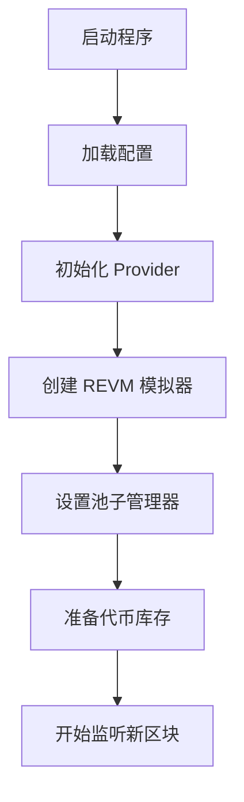
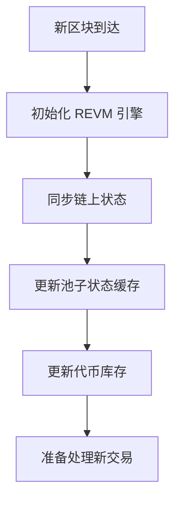
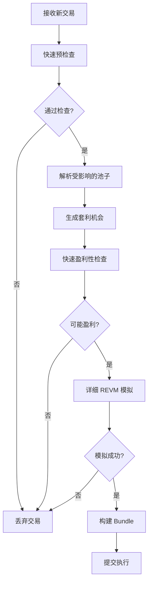
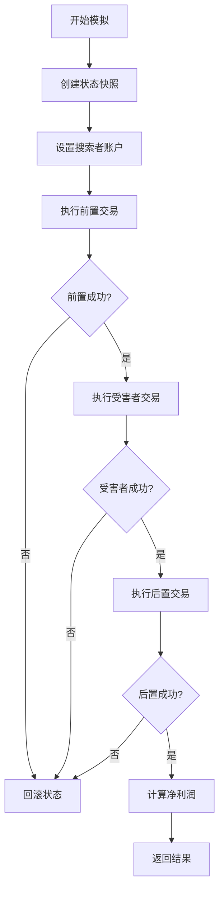
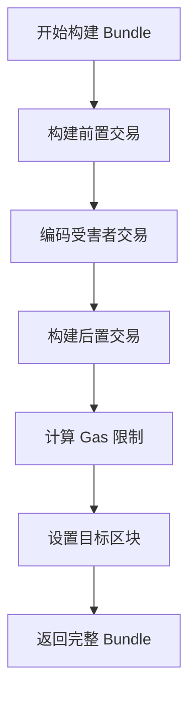

# 🥪 Sandwich 策略快速上手指南

## 🎯 **概述**

Artemis Sandwich 策略是一个完整的 MEV 套利解决方案，集成了高精度的 REVM 模拟引擎，能够在毫秒级时间内识别、模拟和执行 Sandwich 攻击机会。

---

## 🚀 **快速开始**

### **1. 环境准备**

```bash
# 克隆仓库
git clone https://github.com/your-fork/artemis.git
cd artemis

# 切换到生产优化分支
git checkout production-optimized

# 安装依赖
cargo build --release
```

### **2. 配置设置**

创建配置文件 `config/sandwich.toml`：

```toml
[general]
searcher_address = "0xYourSearcherAddress"
min_profit_threshold = "1000000000000000000"  # 1 ETH (wei)
max_gas_price = "50000000000"                 # 50 gwei
weth_address = "0xC02aaA39b223FE8D0A0e5C4F27eAD9083C756Cc2"

[rpc]
mainnet_url = "https://eth-mainnet.alchemyapi.io/v2/your-key"
ws_url = "wss://eth-mainnet.alchemyapi.io/v2/your-key"

[execution]
flashbots_url = "https://relay.flashbots.net"
rbuilder_url = "https://api.rbuilder.xyz"
mev_share_url = "https://mev-share.flashbots.net"

[monitoring]
enable_metrics = true
metrics_port = 8080
log_level = "info"
```

### **3. 运行策略**

```bash
# 运行 Sandwich 策略
cargo run --bin sandwich-bot -- --config config/sandwich.toml

# 或者运行完整示例
cargo run --example sandwich-bot
```

---

## 🔄 **主流程详解**

### **阶段 1: 初始化**



**关键组件初始化：**
```rust
let provider = Provider::new(rpc_url);
let config = SandwichConfig::load("config/sandwich.toml")?;
let state_manager = StateManager::new(provider.clone());
let simulator = SandwichSimulator::new(provider.clone(), config.clone());
let strategy = SandwichStrategy::new(provider, config, state_manager);
```

### **阶段 2: 新区块处理**



**核心代码：**
```rust
async fn process_new_block(&mut self, block: NewBlock) {
    // 初始化 REVM 模拟器
    if let Err(e) = self.simulator.initialize(&self.current_block).await {
        warn!("初始化 REVM 模拟器失败: {:?}", e);
    }
    
    // 定期更新池子状态（每10个区块）
    if block_num % 10 == 0 {
        self.update_pool_states().await?;
    }
    
    // 定期更新代币库存（每5个区块）
    if block_num % 5 == 0 {
        self.update_inventory().await?;
    }
}
```

### **阶段 3: 交易处理**



**核心逻辑：**
```rust
async fn process_transaction(&mut self, tx: Transaction) -> Option<Action> {
    // 1. 快速预检查
    if !self.quick_precheck(&tx) {
        return None;
    }
    
    // 2. 解析受影响的池子
    let affected_pools = self.get_affected_pools(&tx).await?;
    
    // 3. 生成套利机会
    let opportunities = self.generate_opportunities(affected_pools, tx);
    
    // 4. 双阶段模拟
    for opportunity in opportunities {
        // 快速检查
        if !self.simulator.quick_profitability_check(&opportunity, &block).await? {
            continue;
        }
        
        // 详细 REVM 模拟
        let result = self.simulator.simulate_detailed(&opportunity, &block, &inventory).await?;
        if result.success && result.net_profit > min_threshold {
            // 构建并提交 Bundle
            let bundle = self.bundle_builder.build_sandwich_bundle(&opportunity, &block, &inventory).await?;
            return Some(Action::SubmitSandwichBundle(bundle));
        }
    }
    
    None
}
```

### **阶段 4: REVM 模拟**



**模拟核心：**
```rust
pub async fn simulate_detailed(
    &self,
    opportunity: &SandwichOpportunity,
    block: &BlockInfo,
    inventory: &TokenInventory,
) -> Result<SandwichSimulationResult> {
    // 1. 保存初始状态快照
    evm_guard.take_snapshot()?;
    
    // 2. 设置搜索者账户
    evm_guard.state_manager.setup_searcher_account(
        searcher_address,
        inventory.weth_balance,
    )?;
    
    // 3. 模拟前置交易
    let frontrun_result = self.simulate_frontrun_tx(&mut evm_guard, opportunity, searcher_address).await?;
    
    // 4. 模拟受害者交易
    for victim_tx in &opportunity.victim_txs {
        let victim_result = self.simulate_victim_tx(&mut evm_guard, victim_tx).await?;
    }
    
    // 5. 模拟后置交易
    let backrun_result = self.simulate_backrun_tx(&mut evm_guard, opportunity, searcher_address).await?;
    
    // 6. 计算净利润
    let final_weth_balance = evm_guard.state_manager.get_weth_balance(searcher_address)?;
    let net_profit = final_weth_balance.saturating_sub(inventory.weth_balance);
    
    // 7. 回滚状态
    evm_guard.revert_to_snapshot()?;
    
    Ok(SandwichSimulationResult {
        success: true,
        net_profit,
        total_gas_used: frontrun_result.gas_used + backrun_result.gas_used,
        // ... 其他指标
    })
}
```

### **阶段 5: Bundle 构建**



**Bundle 构建：**
```rust
pub async fn build_sandwich_bundle(
    &self,
    opportunity: &SandwichOpportunity,
    block: &BlockInfo,
    inventory: &TokenInventory,
) -> Result<SandwichBundle> {
    // 1. 构建前置交易（买入）
    let frontrun_tx = self.build_frontrun_transaction(opportunity, block, inventory).await?;
    
    // 2. 编码受害者交易
    let victim_txs = self.encode_victim_transactions(&opportunity.victim_txs).await?;
    
    // 3. 构建后置交易（卖出）
    let backrun_tx = self.build_backrun_transaction(opportunity, block, inventory).await?;
    
    // 4. 计算总 gas 使用量
    let estimated_gas = self.calculate_total_gas_limit(opportunity);
    
    Ok(SandwichBundle {
        frontrun_tx,
        victim_txs,
        backrun_tx,
        target_block: block.number,
        expected_revenue: opportunity.estimated_profit,
        estimated_gas,
    })
}
```

---

## 🎛️ **关键配置参数**

### **盈利性参数**
```toml
[profitability]
min_profit_threshold = "1000000000000000000"  # 最小利润 (1 ETH)
min_profit_percentage = 0.5                   # 最小利润率 (0.5%)
max_slippage_tolerance = 0.1                  # 最大滑点容忍 (10%)
```

### **Gas 策略**
```toml
[gas]
max_gas_price = "50000000000"                 # 最大 gas 价格 (50 gwei)
priority_fee_multiplier = 1.1                 # 优先费倍数 (110%)
gas_limit_buffer = 50000                      # Gas 限制缓冲
```

### **风险控制**
```toml
[risk]
max_position_size = "10000000000000000000"    # 最大仓位 (10 ETH)
max_gas_per_bundle = 1000000                  # 最大 Bundle Gas
timeout_seconds = 300                         # 交易超时 (5分钟)
```

---

## 📊 **监控和调试**

### **日志级别设置**
```toml
[logging]
level = "info"  # debug, info, warn, error
format = "json" # json, pretty
```

### **关键指标监控**
```rust
// 性能指标
metrics::counter!("artemis.sandwich.opportunities_found").increment(1);
metrics::histogram!("artemis.sandwich.processing_time").record(processing_time.as_millis() as f64);
metrics::histogram!("artemis.sandwich.estimated_profit").record(profit.as_u128() as f64 / 1e18);

// REVM 指标
metrics::gauge!("artemis.sandwich.revm_initialized").set(1.0);
metrics::histogram!("artemis.sandwich.revm_simulation_time").record(simulation_time.as_millis() as f64);
metrics::counter!("artemis.sandwich.revm_simulations_success").increment(1);
```

### **健康检查端点**
```bash
# 检查策略状态
curl http://localhost:8080/health

# 查看指标
curl http://localhost:8080/metrics

# 查看统计信息
curl http://localhost:8080/stats
```

---

## 🚨 **常见问题和解决方案**

### **问题 1: REVM 初始化失败**
```bash
# 错误: 初始化 REVM 模拟器失败
# 解决: 检查 RPC 连接和网络状态
```
**解决方案：**
- 检查 RPC URL 是否正确
- 确认网络连接稳定
- 检查 API 密钥是否有效

### **问题 2: 池子状态查询失败**
```bash
# 错误: 查询池子储备量失败
# 解决: 检查池子地址和合约调用
```
**解决方案：**
- 确认池子地址正确
- 检查合约是否支持 `getReserves()` 方法
- 验证池子是否为 Uniswap V2 格式

### **问题 3: Bundle 构建失败**
```bash
# 错误: 构建前置交易失败
# 解决: 检查交易参数和 Gas 设置
```
**解决方案：**
- 确认搜索者地址有效
- 检查 WETH 余额充足
- 验证 Gas 价格设置合理

### **问题 4: 模拟精度不高**
```bash
# 问题: REVM 模拟结果不准确
# 解决: 优化状态同步和参数设置
```
**解决方案：**
- 确保区块状态同步完整
- 调整模拟参数精度
- 检查代币合约实现

---

## 🔧 **高级配置**

### **自定义池子发现**
```rust
// 添加自定义池子
let custom_pool = Pool {
    address: "0x...".parse()?,
    token0: "0x...".parse()?,
    token1: "0x...".parse()?,
    reserve0: U256::ZERO,
    reserve1: U256::ZERO,
    last_updated: 0,
};

strategy.pool_manager.add_pool(custom_pool.address, custom_pool);
```

### **自定义路由器支持**
```rust
// 添加新的 DEX 路由器
let custom_router: Address = "0x...".parse()?;
strategy.add_router_address(custom_router);
```

### **动态参数调整**
```rust
// 运行时调整参数
strategy.config.min_profit_threshold = U256::from(2_000_000_000_000_000_000u64); // 2 ETH
strategy.config.max_gas_price = U256::from(100_000_000_000u64); // 100 gwei
```

---

## 📈 **性能优化建议**

### **1. RPC 优化**
- 使用高质量的 RPC 提供商 (Alchemy, Infura)
- 启用 WebSocket 连接进行实时数据
- 配置连接池和重试机制

### **2. 内存优化**
- 定期清理过期的池子状态缓存
- 使用对象池减少分配开销
- 启用 SIMD 数学运算

### **3. 并发优化**
- 调整并发池子查询数量
- 优化 REVM 模拟的并行度
- 使用异步批处理

### **4. 网络优化**
- 部署在靠近矿池的地理位置
- 使用低延迟网络连接
- 优化 Bundle 提交策略

---

## 🎯 **最佳实践**

### **1. 风险控制**
- 设置合理的最大仓位大小
- 监控失败率和回撤
- 实施动态止损机制

### **2. 盈利优化**
- 定期分析成功/失败模式
- 优化 Gas 价格策略
- 调整利润阈值

### **3. 系统稳定性**
- 实施健康检查机制
- 配置自动重启策略
- 监控系统资源使用

### **4. 合规性**
- 了解当地 MEV 法规
- 实施适当的风险披露
- 遵循最佳道德实践

---

## 🚀 **下一步**

1. **测试环境验证** - 在测试网络上验证策略
2. **小资金试运行** - 使用少量资金进行实际测试
3. **性能调优** - 根据实际表现优化参数
4. **规模扩展** - 逐步增加资金和策略复杂度

---

**🎉 现在你已经准备好开始使用 Artemis Sandwich 策略了！**
