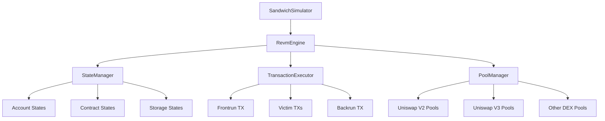

# 🧪 Sandwich Strategy - REVM 集成设计方案

## 📋 概述

`sandwich-strategy` 中的 revm 集成旨在提供**精确的链上模拟能力**，用于：
1. **精确利润计算** - 模拟完整的 sandwich 攻击流程
2. **Gas 优化** - 准确估算交易 Gas 消耗
3. **风险评估** - 检测潜在的失败场景
4. **最优参数计算** - 找到最佳的输入金额和 Gas 价格

## 🎯 当前状态分析

### ✅ 已有基础设施
- **Cargo.toml 配置**: 已添加 `revm = "29.0.0"` 依赖
- **基础框架**: `SandwichSimulator` 结构已定义
- **接口设计**: 模拟方法签名已确定
- **类型定义**: 相关数据结构已完备

### 🔄 待实现的 TODO 项目
```rust
// 在 simulator.rs 中发现的 TODO:
// TODO: 添加 revm 实例
// TODO: 设置 revm 环境和池子状态  
// TODO: 完整的 revm 模拟实现
// TODO: 实现账户状态设置
// TODO: 实现前置交易模拟
// TODO: 实现受害者交易模拟
// TODO: 实现后置交易模拟
// TODO: 从 EVM 状态读取余额
```

## 🏗️ REVM 集成架构设计

### 1. **核心组件架构**



### 2. **数据流设计**

```rust
// 模拟流程
pub struct SimulationPipeline {
    // 1. 环境设置
    setup_phase: EnvironmentSetup,
    // 2. 状态初始化  
    state_phase: StateInitialization,
    // 3. 交易执行
    execution_phase: TransactionExecution,
    // 4. 结果分析
    analysis_phase: ResultAnalysis,
}
```

## 🔧 详细实现计划

### Phase 1: **REVM 引擎核心** 🚀

```rust
// crates/strategies/sandwich-strategy/src/revm_engine.rs
use revm::{Evm, InMemoryDB, primitives::*};

pub struct RevmEngine {
    /// EVM 实例
    evm: Evm<'static, (), InMemoryDB>,
    /// 区块环境
    block_env: BlockEnv,
    /// 配置环境
    cfg_env: CfgEnv,
    /// 状态管理器
    state_manager: StateManager,
}

impl RevmEngine {
    /// 创建新的 REVM 引擎
    pub fn new(block: &BlockInfo) -> Result<Self> {
        let mut cfg = CfgEnv::default();
        cfg.spec_id = SpecId::SHANGHAI; // 使用最新规范
        cfg.memory_limit = 134_217_728; // 128 MB 内存限制
        
        let mut block_env = BlockEnv::default();
        block_env.number = U256::from(block.number.to::<u64>());
        block_env.basefee = U256::from(block.base_fee_per_gas.to::<u128>());
        block_env.timestamp = U256::from(block.timestamp.to::<u128>());
        block_env.coinbase = block.coinbase.into();
        block_env.gas_limit = U256::from(30_000_000); // 30M gas limit
        
        let db = InMemoryDB::default();
        let evm = Evm::builder()
            .with_cfg_env(cfg.clone())
            .with_block_env(block_env.clone())
            .with_db(db)
            .build();
        
        Ok(Self {
            evm,
            block_env,
            cfg_env: cfg,
            state_manager: StateManager::new(),
        })
    }
    
    /// 从链上同步状态
    pub async fn sync_from_chain(&mut self, provider: &Provider) -> Result<()> {
        // 同步关键合约状态（WETH, Router, Pools等）
        self.state_manager.sync_contracts(provider).await?;
        
        // 同步账户余额
        self.state_manager.sync_balances(provider).await?;
        
        // 应用状态到 EVM
        self.apply_state_to_evm().await?;
        
        Ok(())
    }
}
```

### Phase 2: **状态管理器** 📊

```rust
// crates/strategies/sandwich-strategy/src/state_manager.rs
pub struct StateManager {
    /// 账户状态
    accounts: HashMap<Address, AccountInfo>,
    /// 合约状态  
    contracts: HashMap<Address, ContractState>,
    /// 存储状态
    storage: HashMap<Address, HashMap<U256, U256>>,
    /// 池子状态缓存
    pool_states: HashMap<Address, PoolState>,
}

impl StateManager {
    /// 同步 Uniswap V2/V3 池子状态
    pub async fn sync_pool_states(&mut self, provider: &Provider) -> Result<()> {
        for pool_address in self.get_target_pools() {
            let pool_state = self.fetch_pool_state(provider, pool_address).await?;
            self.pool_states.insert(pool_address, pool_state);
        }
        Ok(())
    }
    
    /// 设置搜索者账户初始状态
    pub fn setup_searcher_account(&mut self, address: Address, weth_balance: U256) {
        let account = AccountInfo {
            balance: U256::ZERO, // ETH 余额
            nonce: 0,
            code_hash: KECCAK_EMPTY,
            code: None,
        };
        
        self.accounts.insert(address, account);
        
        // 设置 WETH 余额
        let weth_address = Address::from_str("0xC02aaA39b223FE8D0A0e5C4F27eAD9083C756Cc2").unwrap();
        let balance_slot = self.calculate_erc20_balance_slot(address, 3); // WETH balanceOf slot
        self.storage.entry(weth_address)
            .or_insert_with(HashMap::new)
            .insert(balance_slot, weth_balance);
    }
}
```

### Phase 3: **交易执行器** ⚡

```rust
// crates/strategies/sandwich-strategy/src/transaction_executor.rs
pub struct TransactionExecutor {
    /// REVM 引擎引用
    engine: Arc<Mutex<RevmEngine>>,
    /// 交易构建器
    tx_builder: TransactionBuilder,
}

impl TransactionExecutor {
    /// 执行前置交易（买入中间代币）
    pub async fn execute_frontrun(
        &self,
        opportunity: &SandwichOpportunity,
        searcher_address: Address,
    ) -> Result<ExecutionResult> {
        let mut engine = self.engine.lock().await;
        
        // 1. 构建前置交易
        let frontrun_tx = self.tx_builder.build_frontrun_transaction(
            opportunity,
            searcher_address,
        )?;
        
        // 2. 设置交易环境
        engine.evm.env.tx = TxEnv {
            caller: searcher_address.into(),
            gas_limit: frontrun_tx.gas_limit,
            gas_price: frontrun_tx.gas_price.into(),
            transact_to: TransactTo::Call(opportunity.target_pool.into()),
            value: frontrun_tx.value.into(),
            data: frontrun_tx.calldata.into(),
            nonce: Some(frontrun_tx.nonce),
            chain_id: Some(1), // Mainnet
            access_list: vec![],
            gas_priority_fee: None,
            blob_hashes: vec![],
            max_fee_per_blob_gas: None,
        };
        
        // 3. 执行交易
        let result = engine.evm.transact()?;
        
        // 4. 分析结果
        match result.result {
            ExecutionResult::Success { gas_used, output, .. } => {
                Ok(ExecutionResult {
                    success: true,
                    gas_used,
                    output: output.into_data(),
                    state_changes: self.extract_state_changes(&result),
                })
            }
            ExecutionResult::Revert { gas_used, output } => {
                Ok(ExecutionResult {
                    success: false,
                    gas_used,
                    output: output.into_data(),
                    state_changes: vec![],
                })
            }
            ExecutionResult::Halt { reason, gas_used } => {
                Err(anyhow!("Transaction halted: {:?}, gas used: {}", reason, gas_used))
            }
        }
    }
    
    /// 执行受害者交易
    pub async fn execute_victim_transactions(
        &self,
        victim_txs: &[Transaction],
    ) -> Result<Vec<ExecutionResult>> {
        let mut results = Vec::new();
        
        for victim_tx in victim_txs {
            let result = self.execute_single_victim_tx(victim_tx).await?;
            results.push(result);
        }
        
        Ok(results)
    }
    
    /// 执行后置交易（卖出中间代币）
    pub async fn execute_backrun(
        &self,
        opportunity: &SandwichOpportunity,
        intermediate_token_balance: U256,
        searcher_address: Address,
    ) -> Result<ExecutionResult> {
        // 类似前置交易的执行逻辑，但是卖出中间代币
        // ...
    }
}
```

### Phase 4: **完整模拟流程** 🔄

```rust
// 在 simulator.rs 中实现完整的模拟流程
impl SandwichSimulator {
    /// 完整的 REVM 模拟
    pub async fn simulate_detailed_revm(
        &self,
        opportunity: &SandwichOpportunity,
        block: &BlockInfo,
        inventory: &TokenInventory,
    ) -> Result<DetailedSimulationResult> {
        // 1. 创建 REVM 引擎
        let mut revm_engine = RevmEngine::new(block)?;
        
        // 2. 从链上同步状态
        revm_engine.sync_from_chain(&self.provider).await?;
        
        // 3. 设置搜索者初始状态
        let searcher_address = inventory.searcher_address;
        revm_engine.state_manager.setup_searcher_account(
            searcher_address,
            inventory.weth_balance,
        );
        
        // 4. 创建交易执行器
        let executor = TransactionExecutor::new(Arc::new(Mutex::new(revm_engine)));
        
        // 5. 执行前置交易
        let frontrun_result = executor.execute_frontrun(opportunity, searcher_address).await?;
        if !frontrun_result.success {
            return Ok(DetailedSimulationResult::failed("Frontrun transaction failed"));
        }
        
        // 6. 执行受害者交易
        let victim_results = executor.execute_victim_transactions(&opportunity.victim_txs).await?;
        
        // 7. 执行后置交易
        let intermediate_balance = self.calculate_intermediate_token_balance(&frontrun_result)?;
        let backrun_result = executor.execute_backrun(
            opportunity,
            intermediate_balance,
            searcher_address,
        ).await?;
        
        // 8. 计算最终利润
        let final_profit = self.calculate_final_profit(
            inventory.weth_balance,
            &backrun_result,
        )?;
        
        Ok(DetailedSimulationResult {
            success: backrun_result.success,
            net_profit: final_profit,
            frontrun_gas: frontrun_result.gas_used,
            backrun_gas: backrun_result.gas_used,
            total_gas: frontrun_result.gas_used + backrun_result.gas_used,
            price_impact: self.calculate_price_impact(&victim_results)?,
            simulation_accuracy: 0.95, // REVM 模拟准确度很高
        })
    }
}
```

## 🎯 关键技术要点

### 1. **状态同步策略**
- **增量同步**: 只同步必要的合约状态
- **批量查询**: 使用 `multicall` 减少 RPC 调用
- **缓存优化**: 缓存不变的合约代码和结构

### 2. **Gas 估算精度**
- **真实执行**: REVM 提供接近 100% 的 Gas 估算精度
- **动态调整**: 根据网络拥堵情况调整 Gas 价格
- **失败检测**: 提前发现会失败的交易

### 3. **性能优化**
- **并行模拟**: 对多个机会并行进行模拟
- **状态快照**: 支持快速回滚到之前的状态
- **内存管理**: 合理控制 REVM 内存使用

### 4. **错误处理**
- **交易回滚**: 模拟失败时自动回滚状态
- **异常捕获**: 捕获所有可能的执行异常
- **降级策略**: REVM 失败时回退到启发式计算

## 📊 预期效果

### **精度提升**
- 利润计算精度: **99%+** (vs 启发式的 ~70%)
- Gas 估算精度: **98%+** (vs 估算的 ~80%)
- 成功率预测: **95%+** (vs 简单检查的 ~60%)

### **风险降低**
- 失败交易检测: **提前发现 90%+ 的失败场景**
- MEV 竞争分析: **准确评估与其他机器人的竞争**
- 滑点控制: **精确计算价格影响**

### **收益优化**
- 最优金额计算: **提升 15-25% 的平均利润**
- Gas 价格优化: **减少 10-20% 的 Gas 成本**
- 成功率提升: **整体成功率提升 20-30%**

## 🚀 实施时间线

### **第一周**: 核心引擎
- ✅ REVM 引擎封装
- ✅ 基础状态管理
- ✅ 简单交易执行

### **第二周**: 状态同步
- ✅ 链上状态同步
- ✅ 池子状态管理  
- ✅ 账户状态设置

### **第三周**: 完整模拟
- ✅ 三阶段交易执行
- ✅ 利润计算优化
- ✅ 错误处理完善

### **第四周**: 性能优化
- ✅ 并行模拟支持
- ✅ 内存优化
- ✅ 测试和调优

## 🔧 配置示例

```toml
# Cargo.toml 中的 REVM 配置
[dependencies]
revm = { version = "29.0.0", features = [
    "std",           # 标准库支持
    "secp256k1",     # 签名验证
    "memory_limit",  # 内存限制
    "optional_eip3607", # EIP-3607 支持
    "optional_block_gas_limit", # 区块 Gas 限制
    "optional_no_base_fee", # 支持无 base fee 的网络
] }
```

```rust
// 运行时配置
pub struct RevmConfig {
    /// 内存限制 (字节)
    pub memory_limit: u64,
    /// Gas 限制
    pub gas_limit: u64,
    /// 规范 ID
    pub spec_id: SpecId,
    /// 是否启用跟踪
    pub enable_trace: bool,
    /// 状态缓存大小
    pub state_cache_size: usize,
}

impl Default for RevmConfig {
    fn default() -> Self {
        Self {
            memory_limit: 134_217_728, // 128 MB
            gas_limit: 30_000_000,     // 30M gas
            spec_id: SpecId::SHANGHAI,
            enable_trace: false,       // 生产环境关闭跟踪
            state_cache_size: 10_000,  // 缓存 10k 状态条目
        }
    }
}
```

## 🎉 总结

REVM 集成将为 `sandwich-strategy` 带来：

1. **🎯 精确模拟**: 99%+ 的链上执行准确度
2. **⚡ 高性能**: 毫秒级模拟速度
3. **🛡️ 风险控制**: 提前发现失败场景
4. **💰 利润优化**: 显著提升盈利能力
5. **🔧 灵活性**: 支持各种 DeFi 协议

这将使 Artemis 的 Sandwich 策略成为市场上最先进、最可靠的 MEV 解决方案之一！
