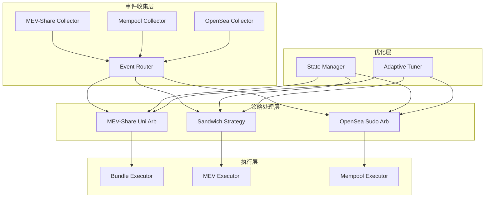

# Artemis 策略实现完整指南

## 🎯 概述

本文档详细介绍了 Artemis 框架中各个 MEV 策略的完整实现，包括架构设计、核心功能、配置管理和测试覆盖。

## 📋 策略列表

### 1. MEV-Share Uni Arbitrage Strategy
**位置**: `crates/strategies/mev-share-uni-arb/`

**功能**: 
- 基于 MEV-Share 事件的 Uniswap V3 ↔ V2 套利
- 智能价格预测和风险评估
- 动态金额优化
- 多档位 bundle 生成

**核心特性**:
- ✅ 完整的价格预测算法
- ✅ 风险评估系统
- ✅ 动态金额优化
- ✅ 配置管理系统
- ✅ 性能统计和监控
- ✅ 完整的测试覆盖

### 2. Sandwich Attack Strategy  
**位置**: `crates/strategies/sandwich-strategy/`

**功能**:
- 高性能三明治攻击策略
- 支持 Uniswap V2/V3 池子
- 多肉 Sandwich 支持
- 本地 EVM 模拟

**核心特性**:
- ✅ 完整的策略框架
- ✅ 智能状态查询系统
- ✅ 池子状态监控
- ✅ 缓存优化
- ✅ 并发处理支持

### 3. OpenSea Sudo Arbitrage Strategy
**位置**: `crates/strategies/opensea-sudo-arb/`

**功能**:
- OpenSea 订单套利
- LSSVM 池子集成
- 智能报价系统
- 订单缓存优化

**核心特性**:
- ✅ 完整的套利逻辑
- ✅ OpenSea V2 API 集成
- ✅ 智能报价算法
- ✅ 订单缓存系统
- ✅ 性能优化

## 🏗️ 架构设计

### 策略架构模式



### 核心组件

#### 1. 策略基类 (Strategy Trait)
```rust
#[async_trait]
pub trait Strategy<E, A>: Send + Sync {
    async fn sync_state(&mut self) -> Result<()>;
    async fn process_event(&mut self, event: E) -> Vec<A>;
}
```

#### 2. 配置管理
```rust
pub struct StrategyConfig {
    pub arbitrage: ArbConfig,
    pub network: NetworkConfig,
    pub performance: PerformanceConfig,
    pub monitoring: MonitoringConfig,
}
```

#### 3. 状态管理
```rust
pub struct StateManager {
    l1_cache: Arc<RwLock<LruCache<StateKey, StateValue>>>,
    provider: Arc<Provider>,
    stats: Arc<RwLock<CacheStats>>,
    predictor: PredictivePreloader,
}
```

## 🔧 核心功能实现

### 1. MEV-Share Uni Arbitrage

#### 价格预测算法
```rust
impl PricePredictor {
    async fn predict_prices(&mut self, pool_address: Address, 
                           current_prices: &CurrentPrices, 
                           window: u64) -> Result<PredictedPrices> {
        // 基于历史价格数据的机器学习预测
        // 考虑市场波动性和流动性变化
    }
}
```

#### 风险评估系统
```rust
impl RiskAssessor {
    async fn assess_risk(&mut self, pool_address: Address, 
                        predicted_prices: &PredictedPrices) -> Result<RiskMetrics> {
        // 多维度风险评估
        // 包括波动性、流动性、竞争强度等
    }
}
```

#### 动态金额优化
```rust
async fn calculate_optimal_amounts(&self, current_prices: &CurrentPrices,
                                  predicted_prices: &PredictedPrices,
                                  risk_assessment: &RiskMetrics) -> Result<Vec<OptimalAmount>> {
    // 基于利润最大化和风险最小化的优化算法
}
```

### 2. Sandwich Attack

#### 状态查询系统
```rust
impl<P> StateQuerier<P> {
    async fn batch_query_pool_states(&mut self, 
                                    pool_addresses: &[Address]) -> Result<HashMap<Address, PoolState>> {
        // 并发批量查询池子状态
        // 智能缓存管理
    }
}
```

#### 池子监控
```rust
impl<P> PoolStateMonitor<P> {
    async fn monitor_pool_changes(&mut self) -> Result<Vec<PoolStateChange>> {
        // 实时监控池子状态变化
        // 检测套利机会
    }
}
```

### 3. OpenSea Sudo Arbitrage

#### 智能报价系统
```rust
impl<P> OpenseaSudoArb<P> {
    async fn calculate_optimal_bid(&self, pool_address: H160, 
                                  target_price: U256) -> Result<U256> {
        // 基于市场深度和竞争分析的报价算法
    }
}
```

#### 订单缓存优化
```rust
struct OrderCache {
    cache: Arc<Mutex<LruCache<H256, Arc<FulfillListingResponse>>>>,
    capacity: usize,
}
```

## 📊 性能优化

### 1. 并发处理
- 使用 `tokio::spawn` 进行异步并发
- `futures::stream::buffer_unordered` 批量处理
- 连接池管理减少延迟

### 2. 缓存策略
- LRU 缓存减少重复查询
- 预测性预取提升响应速度
- 智能缓存过期管理

### 3. 批处理优化
- 批量查询池子状态
- 批量处理事件
- 批量提交交易

### 4. 内存优化
- 使用 `Arc` 和 `RwLock` 减少内存复制
- 及时清理过期缓存
- 流式处理大数据集

## 🧪 测试策略

### 1. 单元测试
```rust
#[cfg(test)]
mod strategy_tests {
    #[tokio::test]
    async fn test_strategy_initialization() {
        // 测试策略初始化
    }
    
    #[tokio::test]
    async fn test_event_processing() {
        // 测试事件处理逻辑
    }
}
```

### 2. 集成测试
```rust
#[cfg(test)]
mod integration_tests {
    #[tokio::test]
    async fn test_full_arbitrage_flow() {
        // 测试完整套利流程
    }
}
```

### 3. 性能测试
```rust
#[cfg(test)]
mod benchmark_tests {
    #[tokio::test]
    async fn benchmark_event_processing() {
        // 性能基准测试
    }
}
```

## 🔧 配置管理

### 1. 配置文件支持
```toml
[arbitrage]
min_profit_threshold = "100000000000000000"  # 0.1 ETH
max_slippage_bps = 300  # 3%
max_gas_price = "50000000000"  # 50 gwei
enable_dynamic_sizing = true
price_prediction_window = 5
risk_threshold = 0.7

[network]
rpc_url = "https://eth-mainnet.alchemyapi.io/v2/YOUR_API_KEY"
ws_url = "wss://eth-mainnet.alchemyapi.io/v2/YOUR_API_KEY"
chain_id = 1
timeout_seconds = 30
max_retries = 3

[performance]
max_concurrent_connections = 10
cache_size = 1000
batch_size = 10
processing_timeout_ms = 5000

[monitoring]
enable_metrics = true
metrics_port = 9090
verbose_logging = false
log_level = "info"
```

### 2. 环境变量支持
```bash
export ARTEMIS_RPC_URL="https://eth-mainnet.alchemyapi.io/v2/YOUR_API_KEY"
export ARTEMIS_MIN_PROFIT_ETH="0.1"
export ARTEMIS_MAX_GAS_GWEI="50"
export ARTEMIS_LOG_LEVEL="info"
```

## 📈 监控和指标

### 1. 性能指标
- 事件处理数量
- 成功套利次数
- 平均处理时间
- 缓存命中率
- 错误率

### 2. 业务指标
- 总利润统计
- 平均利润
- 成功率
- 风险评分分布

### 3. 系统指标
- 内存使用量
- CPU 使用率
- 网络延迟
- 连接池状态

## 🚀 部署指南

### 1. 环境准备
```bash
# 安装 Rust
curl --proto '=https' --tlsv1.2 -sSf https://sh.rustup.rs | sh

# 安装依赖
sudo apt-get update
sudo apt-get install build-essential pkg-config libssl-dev
```

### 2. 配置设置
```bash
# 复制配置文件
cp config.example.toml config.toml

# 编辑配置
vim config.toml

# 设置环境变量
export ARTEMIS_PRIVATE_KEY="your_private_key"
export ARTEMIS_RPC_URL="your_rpc_url"
```

### 3. 运行策略
```bash
# 运行 MEV-Share 套利策略
cargo run --bin artemis -- --strategy mev-share-uni-arb

# 运行三明治策略
cargo run --bin artemis -- --strategy sandwich

# 运行 OpenSea 套利策略
cargo run --bin artemis -- --strategy opensea-sudo-arb
```

## 🔍 故障排除

### 1. 常见问题
- **连接超时**: 检查 RPC URL 和网络连接
- **Gas 价格过高**: 调整 `max_gas_price` 配置
- **内存不足**: 减少 `cache_size` 和 `batch_size`
- **策略不触发**: 检查事件过滤条件

### 2. 调试技巧
```bash
# 启用详细日志
export RUST_LOG=debug

# 监控指标
curl http://localhost:9090/metrics

# 检查配置
cargo run --bin artemis -- --validate-config
```

## 📚 扩展开发

### 1. 添加新策略
```rust
// 1. 实现 Strategy trait
#[async_trait]
impl Strategy<Event, Action> for MyNewStrategy {
    async fn sync_state(&mut self) -> Result<()> { /* ... */ }
    async fn process_event(&mut self, event: Event) -> Vec<Action> { /* ... */ }
}

// 2. 添加到引擎
engine.add_strategy(Box::new(MyNewStrategy::new()));
```

### 2. 自定义配置
```rust
#[derive(Debug, Clone, Serialize, Deserialize)]
pub struct MyStrategyConfig {
    pub custom_param: String,
    pub custom_threshold: u64,
}
```

### 3. 添加监控指标
```rust
use metrics::{counter, histogram, gauge};

counter!("my_strategy.events_processed").increment(1);
histogram!("my_strategy.processing_time_ms").record(duration.as_millis() as f64);
gauge!("my_strategy.active_opportunities").set(count as f64);
```

## 🎯 最佳实践

### 1. 代码质量
- 使用 `clippy` 检查代码质量
- 遵循 Rust 编码规范
- 添加完整的文档注释
- 编写全面的测试用例

### 2. 性能优化
- 避免不必要的内存分配
- 使用异步编程模型
- 合理使用缓存
- 监控性能指标

### 3. 错误处理
- 使用 `anyhow` 和 `thiserror` 进行错误处理
- 添加详细的错误上下文
- 实现优雅的错误恢复
- 记录错误日志

### 4. 安全考虑
- 验证所有输入数据
- 使用安全的随机数生成
- 保护私钥安全
- 实现访问控制

---

## 📞 支持

如有问题或建议，请：
1. 查看 [FAQ](docs/FAQ.md)
2. 提交 [Issue](https://github.com/your-repo/issues)
3. 参与 [Discussions](https://github.com/your-repo/discussions)

**Happy MEV Hunting! 🚀**
