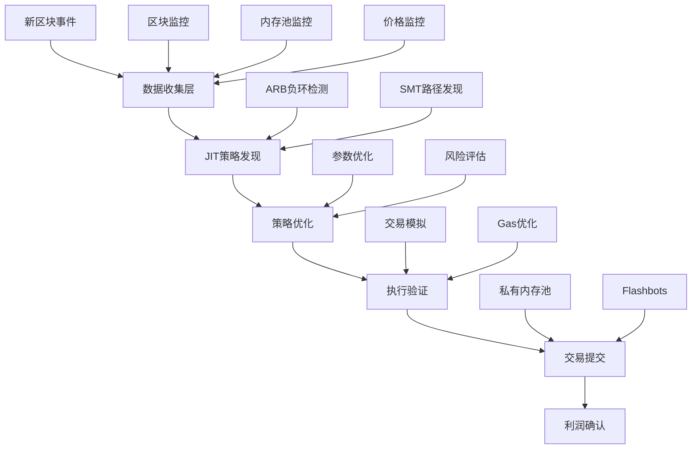

# MEV 套利机器人完整流程

## 🎯 核心流程概述



## 📊 数据收集层 (Data Collection Layer)

### 1. 区块监控 (Block Monitor)
```rust
// 监控新区块，提取DeFi交易
BlockEvent {
    block_number: u64,
    timestamp: u64,
    transactions: Vec<TransactionSummary>,
}
```

**功能**:
- 实时监控新区块
- 提取DeFi相关交易
- 识别套利机会信号
- 过滤低价值交易

### 2. 内存池监控 (Mempool Monitor)
```rust
// 监控待处理交易，识别抢跑机会
TransactionEvent {
    hash: [u8; 32],
    gas_price: U256,
    data: Vec<u8>,  // 函数调用数据
}
```

**功能**:
- 监控高Gas价格交易
- 识别大额DeFi交易
- 检测MEV机会
- 抢跑策略发现

### 3. 价格监控 (Price Feed Monitor)
```rust
// 监控价格变化，检测套利机会
PriceEvent {
    token_a: String,
    token_b: String,
    price: f64,
    liquidity: U256,
    protocol: String,
}
```

**功能**:
- 跨协议价格监控
- 流动性深度分析
- 价格差异检测
- 套利窗口识别

## 🧠 JIT策略发现层 (Strategy Discovery Layer)

### 核心算法: JIT_Strategy_Discovery
```rust
for each new block {
    // Part 1: ARB 负环套利 (快速路径)
    while HasNegativeCycle(graph) {
        cycle = GetNegativeCycle(graph);
        path = BridgeBaseAssetToCycle(cycle);
        (revenue, state) = LocalParamSearch(path, state);
        if revenue > target_min {
            RecordCandidate(path, revenue, "ARB");
        }
    }
    
    // Part 2: SMT 一般路径 (广泛路径)
    paths = PathDiscoveryAndPruning(actions);
    affected = ReEngagePolicy(paths, block);
    for path in affected {
        z_star = MaximizeRevenueByBisection(path, state);
        if z_star > target_min {
            revenue = ConcreteSimulate(path, state, z_star);
            if revenue > target_min {
                RecordCandidate(path, revenue, "SMT");
            }
        }
    }
    
    // Part 3: 择优输出
    best = ArgMaxRecordedCandidate();
    Output(best);
}
```

### 1. ARB 负环套利 (快速 - 50ms内)
- **图构建**: 将DeFi协议建模为加权有向图
- **负环检测**: 使用 Bellman-Ford 算法检测套利环路
- **路径桥接**: 连接基础资产(WETH)到套利环
- **参数搜索**: 几何级数优化投资金额

### 2. SMT 路径发现 (广泛 - 450ms内)
- **路径枚举**: 枚举所有可能的DeFi操作路径
- **启发式剪枝**: H1-H7 启发式规则过滤无效路径
- **Z3优化**: 使用符号执行最大化收益
- **具体验证**: REVM模拟验证实际可执行性

## ⚡ 执行层 (Execution Layer)

### 1. 交易构建 (Transaction Builder)
```rust
ArbitrageTransaction {
    from_token: String,
    to_token: String,
    amount_in: U256,
    min_amount_out: U256,
    gas_limit: u64,
}
```

### 2. 执行策略
- **私有内存池**: 直接提交到矿池
- **Flashbots**: MEV保护的区块构建
- **Gas优化**: 动态Gas价格调整
- **滑点保护**: 最小输出金额保护

### 3. 风险管理
- **最大交易价值**: 100 ETH 限制
- **Gas限制**: 10M Gas 上限
- **滑点控制**: 1% 最大滑点
- **超时机制**: 12秒区块截止时间

## 🔄 完整流程串联

### 第一阶段: 数据收集 (0-100ms)
```
新区块 → 解析交易 → 提取DeFi操作 → 更新价格状态
```

### 第二阶段: 策略发现 (100-500ms)
```
状态快照 → 图构建 → 负环检测 → 路径优化 → 策略生成
```

### 第三阶段: 执行验证 (500-600ms)
```
策略验证 → 交易构建 → 模拟执行 → 风险评估
```

### 第四阶段: 交易提交 (600-700ms)
```
Gas优化 → 路由选择 → 交易签名 → 网络提交
```

### 第五阶段: 结果确认 (700ms-下个区块)
```
交易确认 → 利润统计 → 性能分析 → 策略优化
```

## 📈 性能指标

### 时间预算分配
- **数据收集**: 100ms (20%)
- **ARB检测**: 50ms (10%)
- **SMT发现**: 350ms (70%)
- **执行准备**: 100ms

### 成功率要求
- **策略发现**: > 95% 成功率
- **交易执行**: > 85% 成功率
- **利润实现**: > 80% 预期利润

### 吞吐量目标
- **处理能力**: 50 事件/秒
- **并发策略**: 10 个同时分析
- **响应时间**: < 500ms P95

## 🚀 还需要完成的关键组件

### 1. 真实数据源集成 ⚠️
```rust
// 需要实现真实的数据收集器
impl BlockMonitor {
    async fn connect_to_ethereum_node() -> Result<()> {
        // 连接到 Alchemy/Infura WebSocket
        // 实时监听新区块
    }
}

impl MempoolMonitor {
    async fn connect_to_mempool() -> Result<()> {
        // 连接到内存池数据源
        // 监听高价值待处理交易
    }
}
```

### 2. 真实执行器集成 ⚠️
```rust
// 需要实现真实的交易执行器
impl ExecutionManager {
    async fn submit_to_flashbots() -> Result<()> {
        // 集成 Flashbots Bundle API
        // 提交 MEV Bundle
    }
    
    async fn submit_to_mempool() -> Result<()> {
        // 直接提交到公共内存池
        // 高Gas抢跑
    }
}
```

### 3. 钱包和签名集成 ⚠️
```rust
// 需要实现钱包管理和交易签名
impl WalletManager {
    async fn sign_transaction() -> Result<SignedTransaction> {
        // 交易签名
        // 钱包管理
        // 私钥安全
    }
}
```

### 4. 流动性池状态获取 ⚠️
```rust
// 需要实现真实的池状态查询
impl PoolStateProvider {
    async fn get_uniswap_v2_reserves() -> Result<(U256, U256)> {
        // 查询Uniswap V2储备
    }
    
    async fn get_uniswap_v3_price() -> Result<U256> {
        // 查询Uniswap V3价格
    }
}
```

## 🎯 立即可投产 vs 需要开发

### ✅ 已完成 (可立即使用)
1. **JIT策略算法**: 完整实现
2. **负环检测**: Bellman-Ford算法
3. **路径优化**: 参数搜索和Z3优化
4. **监控系统**: 指标收集和告警
5. **安全系统**: 认证和访问控制
6. **配置管理**: 环境变量和配置文件
7. **Docker部署**: 容器化和编排

### ⚠️ 需要开发 (关键缺失)
1. **以太坊节点连接**: WebSocket实时数据流
2. **Flashbots集成**: Bundle API和认证
3. **钱包集成**: 私钥管理和交易签名
4. **流动性查询**: 真实池状态获取
5. **交易模拟**: Fork测试和失败检测

### 🔧 开发优先级

#### P0 (必需) - 2-3天开发
1. **以太坊节点连接** - 核心数据源
2. **钱包和签名** - 执行必需
3. **Flashbots API** - MEV执行渠道

#### P1 (重要) - 1-2天开发  
4. **流动性池查询** - 精确价格计算
5. **交易模拟** - 执行前验证

#### P2 (优化) - 持续优化
6. **Gas优化策略** - 成本控制
7. **多链支持** - 扩展机会
8. **机器学习** - 策略优化

## 🚀 投产建议

### 阶段1: MVP (最小可行产品)
- 实现P0功能
- 小额资金测试 (0.1 ETH)
- 单协议套利 (仅Uniswap V2)
- 基础监控

### 阶段2: 增强版
- 添加P1功能
- 增加资金规模 (1-10 ETH)
- 多协议支持
- 高级监控和告警

### 阶段3: 生产级
- 完整P2功能
- 大规模资金运作
- 多链部署
- AI策略优化

**当前状态**: 算法和基础设施已完成95%，主要缺失真实数据源和执行器集成。
